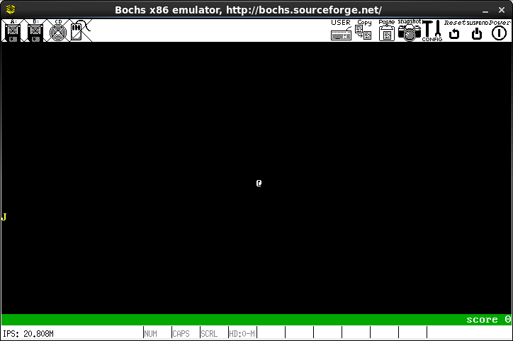
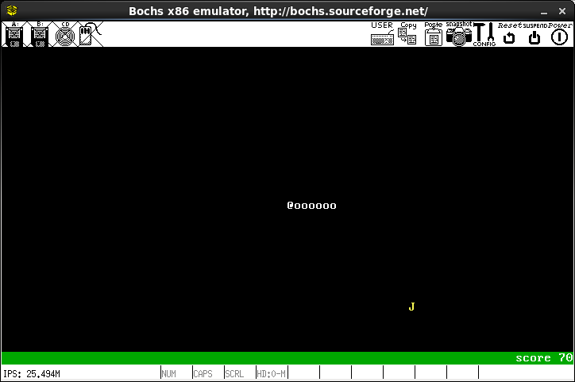

## 情報学群実験第2 ミニレポート

# はじめに
　情報学群実験第2の授業では，VRAMに値を書き込むことで画面上に文字を描画出来ることを学んだ．また，60分の1秒程度の一定時間ごとにVRAMの内容を読み出し，表示装置に送る画像信号を生成するようなハードウェアが搭載されていることも学んだ．これらのことから，私たちは，周期的にVRAMを書き換え画面表示を変更させることで，アニメーションを表示させることが可能であると考えた．

# 実験の目的
　本実験の目的は，周期的にVRAMを書き換えることで，アニメーション表示が可能であることを確認することである．また，これを作成するにあたって以下の点に着目した．
  
- どのような方法でその周期を発生させるか  
- どのような方法でVRAMを書き換えるのが適切か  
 
# 実験方法
　本実験は，Bochsというエミュレータ上で行う．OSは様々なハードウェアを保護する役割を持っているため，通常VRAMに直接読み書きをすることはできない．そこで，ブートストラップローダと呼ばれる，OSを起動する前に実行されるプログラムに記述する．これは，OSが起動される前に実行されるため，VRAMを含む全てのハードウェアに自由にアクセスすることができる．  
　このブートストラップローダの記述されたファイルを仮想ハードディスクとしてエミュレータに読み込ませることで，Bochsを起動した際に作成したプログラムを実行する．  

　本実験では，私たちはワームというゲームをアセンブリ言語で作成した．このゲームは，「画面の中央に初期配置されたワームを操作し，画面端やワームの体に接触しないようにしながら，ランダムに現れるアイテム(J)を食べさせ，ワームを長くしていく」というものである．WASDキーがそれぞれ上，左，下，右方向の移動に対応しており，キーを入力すると移動する方向が変更される．  
　プログラムのアルゴリズムは，下記の要素から実装されている．  

1. スタート画面表示部分
    1. 画面を背景色で塗りつぶす
    2. ゲームタイトルを表示する
    3. 操作説明を表示する
    4. 何らかのキーが入力されたらゲーム本体に移る

2. ゲーム本体
    1. パラメータを初期化
    2. 画面を背景色で塗りつぶす
    3. アイテムを描画する．もし，アイテムの座標が設定されていなければ，座標をランダムで決定する
    4. キーボード入力を読み取り，ワームの進行方向を決める．入力が無ければ，そのまま進む
    5. 進行方向をもとにワームの位置を求める
    6. ワームの位置座標が壁に衝突していれば，コンティニュー画面表示部分に移る
    7. ワームの頭を描画し，ワームの長さに応じて胴体を描画する
    8. ワームの頭が自身の体に衝突していれば，コンティニュー画面表示部分に移る
    9. アイテムとワームの位置座標が一致すれば，ワームの長さを伸ばし，アイテムを消す　
    10. ワームの長さに応じたスコアを右下に表示する
    11. ウェイトファクションを使用して一定時間停止する
    12. iに戻る

3. コンティニュー画面表示部分
    1. ゲームオーバー画面を表示する
    2. キーボード入力を読み取り，ゲームの続行判定を行う
    3. 続行するならば，ゲーム本体に移る
    4. 終了するならば，画面を塗りつぶし，CPUを停止

 上記のアルゴリズムは，下記のサブルーチンを用いることで設計されている．このように分割することで，プログラムを分かりやすく，かつ短くするようにしている．

- 画面を塗りつぶすサブルーチン
- ウェイトファクションを使用して一定時間停止するサブルーチン
- ワームの頭の位置が何行目かを導出するサブルーチン
- アイテムの座標作成のために乱数を作成するサブルーチン
- ワームの長さに応じたスコアを画面右下に描画するサブルーチン
- ゲームタイトルのロゴを描画するサブルーチン
- テキストを描画するサブルーチン

 このプログラムを実装する上での工夫は以下の通りである．

- 乱数の生成
    - George Marsaglia氏の発明したxorshiftを利用している．
- キーボード入力
    - BIOSのサービス割り込みのキーボード入力読み込みを使用している．キーボード入力読み込みは，入力を受けるまでプログラムが停止する．そのため，キーボードステータス取得を呼び出し，キーボード入力が確認された場合のみ，キーボード入力読み込みを使用することにした．これにより，プログラムを停止させずにデータ入力レジスタから入力値を取り出すことに成功した．
- プログラムサイズの限界を大きくする
    - ブートストラップローダ内からセカンダリローダを読み込むことで実現している．詳細は下記．
- ワームのボディの座標管理
    - ワームのボディの座標を管理しているbodyのデータ構造には，キューを用いることで，通常の配列を用いた場合に比べて大きく計算量を削減することに成功した．
- スタート画面
    - アイテムはバナナをモチーフにしており，それをロゴに取り入れ点滅させることにより，デザイン性の向上に成功した．
    - タイトルロゴの裏に影を落として描画することにより立体感を増すことに成功した．また，影を先に描画することにより，データ量とコード量の削減に成功した．   
    - ロゴの描画では，はじめに描画位置を設定し，その位置からの差分をメモリ上に格納してループを用いることで，コード量とメモリ量を削減することに成功した．
    
　ブートストラップローダは，呼び出し側のROMの仕様のため，512Bまでしかロードできない．そのため，それ以上の容量のプログラムをロードする場合は，最初にロードされた512Bのブートストラップローダであるプライマリブートローダ内で，ディスク上に格納されたセカンダリブートローダを読み込み，メモリに格納する必要がある．  
　セカンダリブートローダの読み込みには，BIOSのサービス割り込みの一つであるディスクサービスのセクタ読み込みを使用している．その後，セカンダリブートローダの格納先にジャンプすることで，セカンダリブートローダを呼び出している．  
　bochsに渡すファイルはハードディスクの代わりとなる．ハードディスクの最小単位であるセクタは512Bなので，ファイルサイズを512Bの整数倍に調整し，bochsrcのspt(sectors per track)の値をファイルサイズのセクタ換算の数に変更した．

# 実験結果
 作成したプログラムの実験結果として，以下のような画面結果が得られた．

1. スタート画面  

2. ゲーム画面  

3. コンティニュー画面  

# 考察
　今回の実験で，周期的にVRAMの中身を書き換えることにより，アニメーション表示が可能であることが確認できた．  
　また，BIOSのサービスの一つであるシステムサービスのウェイトファクションを使用することで，適切な周期を生み出すことができることが分かった．ただし，今回のエミュレータのシステムのタイマは不正確であったため，適切な周期を算出することはできなかった．  
　効率的にVRAMを書き換える方法については，前の描画位置からの差分をメモリ上に格納し，描画を一般化してループを用いることで，プログラムを短く，かつ必要なメモリ量を小さく抑えることに成功した．